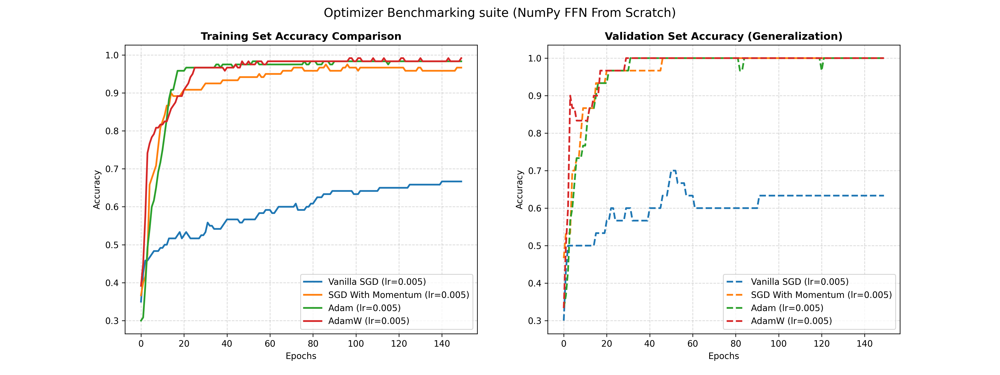

# Custom Feedforward Neural Network (FFN) From Scratch in NumPy

A fully manual implementation of a Feedforward Neural Network built using only Python and NumPy, without any deep learning frameworks such as PyTorch or TensorFlow. The goal of this project is to demonstrate the complete training pipeline of neural networks, including forward propagation, backpropagation, and gradient-based optimization using explicit matrix calculus.

The architecture uses ReLU activations in hidden layers and a Softmax + Cross-Entropy output layer, enabling a simplified and numerically stable gradient formulation of the form \( \hat{y} - y \) at the output layer, which makes manual backpropagation more interpretable.

---

# 🚀 Key Features

### Pure NumPy Implementation
Every component of the neural network is implemented directly with NumPy, including matrix multiplications, activation functions, gradient calculations, and parameter updates.

### Modular Optimizer Framework
Supports multiple optimization algorithms for performance comparison and convergence analysis:
* Stochastic Gradient Descent (SGD)
* SGD with Momentum
* Adam
* AdamW

### He (Kaiming) Weight Initialization
Weights are initialized using variance scaling based on layer dimensions, helping maintain signal propagation and preventing vanishing or exploding gradients.

### Model Checkpointing
Automatically tracks the highest validation accuracy during training and saves the best-performing parameter set as a serialized .pkl checkpoint.

### Inference step
Provides a standalone inference flow that loads trained weights and performs classification on unseen data without requiring gradient tracking or training computations.

---

# 📊 Optimizer Benchmarking Performance

The network was trained on the standardized Iris dataset for **150 epochs** using a **mini-batch size of 32**. Both training and validation accuracy are tracked throughout training to evaluate convergence speed and generalization performance.

## Convergence Analysis

### Experimental Highlights

#### Adam
Adam achieves rapid convergence through adaptive learning rates and first/second-moment gradient estimation, reaching high validation accuracy with minimal oscillation.

#### AdamW
AdamW improves upon Adam by decoupling weight decay from gradient updates, producing stronger regularization and better generalization performance.

#### SGD with Momentum
Momentum accelerates optimization by incorporating previous gradient directions, helping the network escape shallow local minima and reducing noisy updates.

#### Vanilla SGD
Traditional SGD serves as a baseline optimizer and generally converges more slowly due to its lack of momentum and adaptive learning mechanisms.

---

# 🛠️ Project Structure

├── data_loader.py
│   └── Data acquisition, normalization, and train-test splitting
│
├── inference.py
│   └── Standalone inference Workflow
│
├── main.py
│   └── Training loops, benchmarking, and hyperparameter configuration
│
├── best_iris_model.pkl
│   └── Serialized checkpoint containing the best-performing weights
│
└── model/
    ├── __init__.py
    ├── model.py
    │   └── Feedforward architecture and manual backpropagation
    │
    └── optimizers.py
        └── SGD, Momentum, Adam, and AdamW implementations

---

# 🧠 Mathematical Foundations

## 1. He (Kaiming) Initialization

To preserve variance across deep networks and maintain stable gradient flow, weights are initialized according to:

$$W = \mathcal{N}(0,1)\sqrt{\frac{2}{n_{in}}}$$

where:
* W = weight matrix
* n_in = number of incoming neurons to the layer

This initialization is particularly effective for ReLU-based networks.

---

## 2. Forward Propagation & Activation Strategy

Data streams sequentially through the network layers. **ReLU (Rectified Linear Unit)** was deliberately chosen to activate the hidden layers because its derivative is incredibly straightforward to compute manually (1 if x > 0, otherwise 0). This ensures stable, non-vanishing gradient propagation while keeping raw NumPy operations highly legible.

For a hidden layer:

$$Z^{[l]} = A^{[l-1]}W^{[l]} + b^{[l]}$$

$$A^{[l]} = \text{ReLU}(Z^{[l]}) = \max(0,Z^{[l]})$$

For the final output layer, raw logits are transformed into categorical probability distributions using the **Softmax** function:

$$Z^{[L]} = A^{[L-1]}W^{[L]} + b^{[L]}$$

$$\hat{Y}_i = P_i = \frac{e^{Z_i}}{\sum_{j=1}^{K}e^{Z_j}}$$

where K is the number of target classes.

---

## 3. Cross-Entropy Loss

To evaluate classification performance, the network calculates the categorical Cross-Entropy Loss over a given batch:

$$\mathcal{L} = -\frac{1}{m} \sum_{i=1}^{m} \sum_{c=1}^{K} y_{ic}\log(\hat{y}_{ic})$$

where m is the mini-batch size, y represents the true one-hot encoded labels, and \hat{y} (or P) represents the predicted probabilities.

---

## 4. Backpropagation & The Optimization Shortcut

Isolated, the individual matrix derivatives of either Softmax or Cross-Entropy are mathematically grueling, involving high-dimensional quotient rules and complex Jacobian structures. 

However, this project leverages a profound mathematical synergy: **when Softmax activations are fused directly with a Cross-Entropy Loss function at the output layer, their mathematical derivatives cancel out perfectly during manual backpropagation.** This reduces the initial error gradient of the final layer down to a simple, clean linear subtraction:

$$\delta^{[L]} = \frac{\partial \mathcal{L}}{\partial Z^{[L]}} = \hat{Y} - Y \quad (\text{or } y' - y)$$

This algebraic shortcut allows the entire manual backpropagation chain to kick off instantaneously with a basic subtraction step, completely avoiding immense computational overhead.

### Layer Gradient Evaluations
From this starting error vector, the upstream gradients are systematically calculated and pushed backward through the network layers:

* **Final Layer Weights Gradient:**
$$\frac{\partial \mathcal{L}}{\partial W^{[L]}} = \frac{1}{m} (A^{[L-1]})^T \delta^{[L]}$$

* **Final Layer Biases Gradient:**
$$\frac{\partial \mathcal{L}}{\partial b^{[L]}} = \frac{1}{m} \sum \delta^{[L]}$$

* **Error Propagation to Hidden Layers:**
$$\delta^{[l]} = \left(\delta^{[l+1]}(W^{[l+1]})^T\right) \odot \text{ReLU}'(Z^{[l]})$$

where the element-wise ReLU derivative acts as a simple binary gateway filter:

$$
\text{ReLU}'(z)=
\begin{cases}
1, & z > 0 \\
0, & z \le 0
\end{cases}
$$

* **Hidden Layer Weights & Biases Gradients:**
$$\frac{\partial \mathcal{L}}{\partial W^{[l]}} = \frac{1}{m} (A^{[l-1]})^T \delta^{[l]}$$

$$\frac{\partial \mathcal{L}}{\partial b^{[l]}} = \frac{1}{m} \sum \delta^{[l]}$$

> 💡 **Architectural Note on Scaling:** While this manual implementation relies on the mathematical simplicity of ReLU and Softmax+Cross-Entropy for clarity, automated differentiation systems (like the production-ready PyTorch framework refactor included in this project folder) can easily swap these for advanced smooth, non-monotonic functions such as **GELU** (transformer standards), **SiLU/Swish** (modern CNN layouts), or **Mish** to optimize deeper network paths.

---

# 🏃‍♂️ Running the Project

## Install Dependencies

pip install numpy matplotlib scikit-learn

---

## Train and Benchmark Optimizers

Execute the training suite:

python main.py

This will:
* Train all optimizer variants
* Generate convergence plots
* Evaluate validation performance
* Automatically save the best-performing model

---

## Run Inference 

Load the serialized checkpoint and classify unseen samples:

python inference.py

---

# 🌟 Strategic Takeaway: Transfer Learning Potential

Although originally trained on the Iris dataset, the architecture supports transfer learning workflows. The learned feature extraction layers can be reused as a pretrained backbone in larger classification systems through:

### Feature Extraction (Freezing Weights)
$$\frac{\partial \mathcal{L}}{\partial W} = 0$$

### Fine-Tuning
$$\eta_{\text{fine-tune}} \ll \eta_{\text{original}}$$

This allows the network to retain previously learned representations while adapting to new datasets and tasks.

---

## Summary

This project demonstrates a complete neural network implementation from first principles using only NumPy, covering:
* Forward propagation
* Backpropagation
* Cross-Entropy optimization
* He initialization
* SGD, Momentum, Adam, and AdamW optimizers
* Model checkpointing
* Standalone inference workflow
* Transfer learning foundations

The result is a fully transparent deep learning framework that exposes every mathematical operation involved in training modern neural networks.
